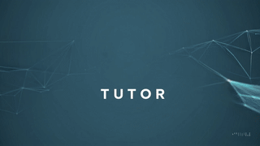

# **TUTOR**

**TUTOR** is an AI-powered educational assistant designed to help users with **audio transcription**, **PDF text extraction**, and **question answering**. It leverages advanced AI models and **Retrieval-Augmented Generation (RAG)** to provide accurate and contextually relevant responses based on uploaded content.




---

## 🚀 **Features**

- 🎙️ **Audio Transcription:** Upload audio files and get accurate transcriptions instantly.
- 📄 **PDF Text Extraction:** Extract valuable insights from PDF documents effortlessly.
- 💬 **Question Answering:** Ask questions based on uploaded content and get AI-powered answers.
- 🧠 **General AI Tutor:** Ask general questions and receive context-aware AI responses.

---

## 🎯 **Why TUTOR is Different?**

Traditional LLM applications often struggle with delivering accurate, context-aware answers. **TUTOR** leverages **Retrieval-Augmented Generation (RAG)** to combine the power of large language models with a **curated knowledge base**.

This ensures:
- Responses are not solely based on pre-trained data.
- Answers are grounded in the **specific content provided by the user** (audio transcriptions or PDF text).
- Enhanced **accuracy** and **contextual relevance**.

---

## 🌐 **Try Out TUTOR**

- **Streamlit Version:** Try the online version of TUTOR directly at **[Streamlit App Link](#)**.
- **Web App Version:** The Flask web app version needs to be installed and run locally following the [Setup Instructions](setup/setup-instructions.md). and demo is here for web app
   - 🖼️ **Web App Demo [(Screenshots Preview)](webAppDemo.md)**
   
---

## ⚙️ **Setup Instructions**

For detailed setup instructions, please refer to the **[Setup Instructions](setup/setup-instructions.md)** file.

Quick Start:
```sh
# Clone the repository
git clone https://github.com/slfagrouche/TUTOR.git
cd TUTOR

# Create and activate a virtual environment
python -m venv venv
source venv/bin/activate  # On Windows: .\venv\Scripts\activate

# Install dependencies
pip install -r requirements.txt

# Add API keys to .env
# Run the app
python app.py
```

---

## 🤝 **Contributing**

We welcome contributions! Follow these steps:
1. Fork the repository.
2. Create your feature branch:
   ```sh
   git checkout -b feature/AmazingFeature
   ```
3. Commit your changes:
   ```sh
   git commit -m "Add some AmazingFeature"
   ```
4. Push to your branch:
   ```sh
   git push origin feature/AmazingFeature
   ```
5. Open a **Pull Request**.

---

## 📄 **License**

Distributed under the **MIT License**. See the `LICENSE` file for more information.

---

For further assistance, reach out via [GitHub Issues](https://github.com/slfagrouche/TUTOR/issues).

Happy Coding! :)

